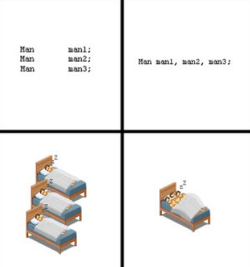

## Проектирование структур
Чтобы упростить код, следует объединять схожие данные в контейнеры:
- пользовательские структуры
- контейнеры SFML: sf::Vector2f, sf::FloatRect
- контейнеры STL: std::vector, std::list, std::map
С помощью ООП можно вместо структур проектировать классы, но ООП не изучается в рамках 3-го семестра, и мы рассматриваем код без ООП.

### typedef и структуры
Если вы видете подобный код, знайте, это стиль языка C, использованный кем-то в C++
```cpp
typedef struct tag_UnitLogic
{
    float dx, dy, x, y, speed;
    int w, h, health;
    bool life, isMove, isSelect;
    std::string name;
} UnitLogic;
```
В языке C на выходе получим два типа: один называется ```struct tag_UnitLogic```, второй короче: ```UnitLogic```. Тогда понятно, зачем typedef: чтобы не пришлось везде при использовании дописывать struct. Пример:
```cpp
void foo()
{
    struct tag_UnitLogic unitLogic;
    InitLogic(unitLogic);
    // ...
}
```
В C++ дописывать struct не обязательно! В результате смысл трюка с typedef теряется, и надо писать проще:
```cpp
struct UnitLogic
{
    float dx, dy, x, y, speed;
    int w, h, health;
    bool life, isMove, isSelect;
    std::string name;
};
```

С другой стороны, typedef может быть полезен, если структура вообще не нужна, а удобное имя типа иметь хочется. Пример: была структура данных
```cpp
struct MapObjects
{
    std::vector<Object> obj;
    std::vector<Object>::iterator it;
}

void foo(MapObjects &objects)
{
    for (objects.it = objects.begin(); objects.it != objects.end(); ++objects.it)
    {
       // ...
    }
}
```
Позже студент понял, что итератор в структуре запоминать не нужно. Подробнее см. [статью о for и коллекциях](vector-for-loop.md)
```cpp
struct MapObjects
{
    std::vector<Object> obj;
}

void foo(MapObjects &objects)
{
    for (Object& obj : objects.obj)
    {
       // ...
    }
}
```
Но зачем структура, если она содержит всего одно поле? Её можно убрать, сделав код обработки коллекции ещё короче:
```cpp
typedef std::vector<Object> MapObjects;

void foo(MapObjects &objects)
{
    for (Object& obj : objects)
    {
       // ...
    }
}
```

### Пользовательские структуры
Хорошо подходят для разнородных данных. В сети легко найти примеры дурного оформления структур. Вот вам дурно оформленная структура, содержащая логическую модель абстрактного юнита (без визуальной составляющей):
```cpp
struct UnitLogic
{
    float dx, dy, x, y, speed;
    int w, h, health;
    bool life, isMove, isSelect;
    std::string name;
};
```
Проблемы:
- поля life, isMove, isSelect названы неподобающе для полей типа bool
- общее число полей можно уменьшить с помощью контейнеров SFML (хорошо ещё, что для хранения имени уже используется контейнер из STL: ```std::string```)
- переменная speed хранит абсолютную скорость без направления, что в 2D играх бывает неудобным
- несколько переменных объявлены на одной строке, см. картинку:


Начнём с наименьших проблем
- переименуем поля с типом bool
- используем sf::Vector2f для хранения пар (x, y)
- не объявляем несколько переменных на строку
```cpp
struct UnitLogic
{
    sf::Vector2f distance; // was: 'float dx, dy'.
    sf::Vector2f pos; // was: 'float x, y'.
    float speed;
    sf::Vector2i size; // was: 'int w, h'.
    int health;
    // was: 'life, isMove, isSelect'.
    bool alive;
    bool isMoving;
    bool isSelected;
    std::string name;
}
```
Если убрать комментарии, код будет гораздо чище предыдущего для постороннего читателя. Но если игра двумерная с видом сверху, то зачем хранить скорость в формате float? Мы можем хранить скорость как 2D-вектор и использовать простейшую тригонометрию для работы с ней.
```cpp
struct UnitLogic
{
    sf::Vector2f distance;
    sf::Vector2f pos;
    sf::Vector2f speed;
    sf::Vector2i size;
    int health;
    bool alive;
    bool isMoving;
    bool isSelected;
    std::string name;
}
```

### Читать далее
- разница между структурами и классами: http://stackoverflow.com/questions/54585/when-should-you-use-a-class-vs-a-struct-in-c
- использование enum: http://stackoverflow.com/questions/10869790/best-practices-for-enum-in-c
- [Дизайн математической библиотечки](vector-math.md)
